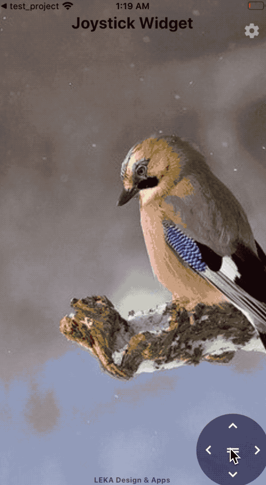

# joystick

A joystick widget for Flutter your apps.

It's design can be customized like background/icon color or opacity.

To set this joystick draggable is optional.

You can also use only vertical or horizontal direction arrows instead of all direction arrows.

